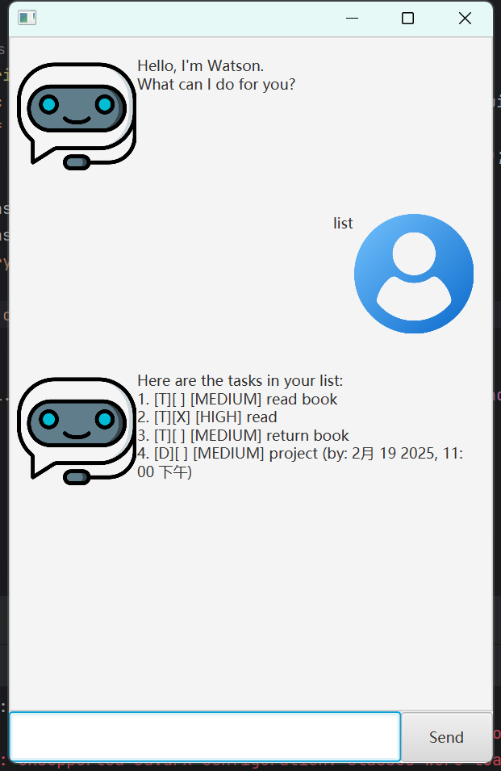

# Watson User Guide



## Welcome User! 
This is **Watson**, an application is optimized for usage via a Command Line Interface (CLI) while still having a Graphical User Interface (GUI).

With **Watson**, you can:
- [x]  Add
    - ToDo
    - Deadlines
    - Events
- [x]  List
- [x]  Mark/ Unmark as complete
- [x]  Find
- [x]  Priority

***ALL your tasks***

### Features

## Adding ToDos

You may add ToDo tasks by typing the following command:
```
todo {task name}
```

For example:
```
todo read books
```

## Adding Deadlines

You may add Deadline tasks by typing the following command:
```
deadline {task name} /by {dd/mm/yyyy HHmm}
```

For instance:
```
deadline individual project /by 21/02/2025 1600
```

## Adding Events

You may add Deadline tasks by typing the following command:
```
event {task name} /from {dd/mm/yyyy HHmm} /to {dd/mm/yyyy HHmm}
```

For instance:
```
event debug /from 19/02/2025 1200 /to 21/02/2025 1600
```

## Listing All Tasks

To see all the tasks added, simply type:

```
list
```

## Marking/ Unmarking a Task

To mark/ unmark the completion of your tasks, simply type:
```
mark {task number}
unmark {task number}
```


> Use the `list` to check the task number

For instance:
```
mark 1
unmark 1
```

## Find Feature

You may find any tasks by typing the following command:
```
find {keyword}
```

For instance:
```
find project
```

## Priority

Label the urgency of any task in your list, simply type:
```
priority {task number} {HIGH/MEDIUM/LOW}
```
> Default priority of any task added is MEDIUM

For instance:
```
priority 2 HIGH
```

